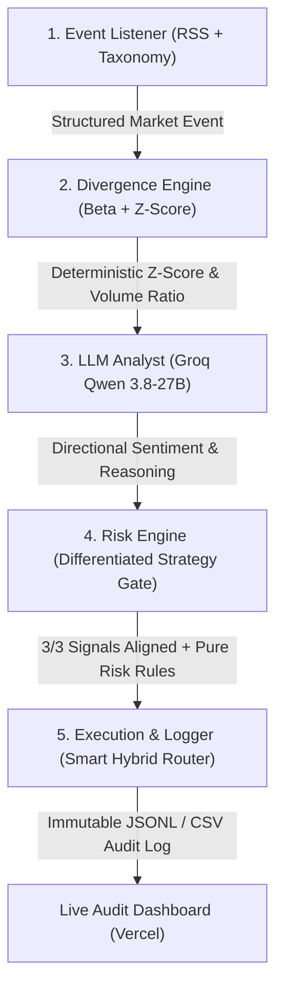

# AfterHours Sentinel

> **Autonomous Event-Driven Trading Agent for Tokenized U.S. Equities (rTokens) on Bitget**  
> *Bitget AI Base Camp Hackathon S2 — Agentic Trading Track (Event-Driven Agent Sub-Theme)*  
> **Live Audit Dashboard:** [https://afterhours-sentinel.vercel.app/](https://afterhours-sentinel.vercel.app/)  
> **GitHub Repository:** [https://github.com/0xSheriff/afterhours-sentinel](https://github.com/0xSheriff/afterhours-sentinel)

---

## 1. Overview & Core Thesis

**AfterHours Sentinel** is an autonomous, event-driven trading agent engineered to exploit price dislocations in tokenized U.S. equities (rTokens) on Bitget during after-hours sessions (post-market 16:00–09:30 ET and 24/7 weekends).

After-hours equity markets exhibit structural liquidity thinning. When breaking macroeconomic news, tariff announcements, or earnings releases occur, orderbooks experience extreme asymmetry:
1. **Thin-Liquidity Knee-Jerk Overreactions (Mean Reversion):** Algorithmic stop-runs and retail panic cause prices to dislocate far beyond benchmark-implied moves on weak volume. Sentinel detects these statistical anomalies ($|z| \ge 2.0\sigma$) and executes disciplined mean-reverting fade trades with strict risk controls.
2. **Persistent Fundamental Catalysts (Momentum / PEAD):** In genuine earnings surprises and major product releases, price dislocations backed by heavy, confirming volume continue drifting in the catalyst direction (Post-Earnings Announcement Drift). Sentinel routes these to a momentum qualification engine.

---

## 2. Non-Negotiable Safety Constraints

To guarantee strict capital protection and zero unintended exposure:
1. **Paper-Trading Isolation**: All execution targets Bitget Agent Hub in `--paper-trading` mode against Bitget's Demo environment (`DEMO_MODE=True`). Mainnet live accounts are strictly isolated.
2. **Smart Hybrid Execution Router**: Operates with `DEFAULT_DRY_RUN = False` in [`config.py`](file:///Users/mac/AH-Sentinel/config.py) under the **Smart Hybrid Execution Router**. Contracts actively listed on Bitget Demo (`NVDA`, `TSLA`, `AAPL`, `AMZN`, `GOOGL`, `META`, `COIN`, `MSTR`, `BTC`, `ETH`) route live orders directly to the Bitget Demo matching engine, while unlisted demo contracts (`MSFT`, `PLTR`, `ARM`, etc.) seamlessly execute in client-side paper simulation with zero rejection errors.
3. **Zero Dangerous Endpoints**: Zero withdrawal, transfer, or mass-cancellation endpoints exist in the codebase.
4. **Transparent Client Logging**: Tracks routing via `BitgetAgentHubClient` against official `api.bitget.com` demo endpoints with fallback to local `MockExecutionClient`.

---

## 3. Architecture (Strict 5-Stage Pipeline)



### Component Breakdown & Mathematical Rigor

#### 1. Event Listener (`event_listener.py`)
- Polls real-time financial and macroeconomic news feeds (Yahoo Finance, Investing.com, MarketWatch) with automated deduplication and a strict **4-hour freshness filter**.
- **Zero-Cost Entity Resolver**: Accurately extracts company names, tickers, products, and executive leadership (e.g. Musk, Nadella, Saylor, Karp) across all **15 Bitget single-stock equities**. Events without equity mentions are classified as `SKIPPED_NO_ASSET_MATCH` with **zero LLM tokens spent**.
- **Standardized 9-Category Taxonomy**: Categorizes news into `earnings`, `macro`, `regulatory`, `tariff`, `geopolitical`, `product`, `corporate`, `analyst`, and `other`.

#### 2. Deterministic Divergence Engine (`divergence_engine.py`)
- Pure, deterministic mathematics with **zero LLM dependencies**:
  $$\beta = \frac{\text{Cov}(R_{\text{asset}}, R_{\text{bench}})}{\text{Var}(R_{\text{bench}})} \quad (\text{30-day rolling baseline})$$
  $$\text{expected\_move} = \beta \times \Delta_{\text{bench}}$$
  $$\text{residual} = \Delta_{\text{actual}} - \text{expected\_move}$$
  $$z = \frac{\text{residual}}{\sigma_{\text{residual}}} \quad (\text{defensive volatility floor } \sigma_{\min} = 80\text{ bps})$$
  $$\text{volume\_ratio} = \frac{\text{Volume}_{\text{after\_hours}}}{\overline{\text{Volume}}_{\text{trailing}}}$$
- **Empirical Volume Fallback**: When Bitget Demo 1H candle history is sparse ($<3$ candles), Sentinel dynamically falls back to the rolling 24H ticker volume normalized to hourly ($\text{Vol}_{24\text{h}} / 24$). Tagged `volume_basis: "FALLBACK_ESTIMATE"` for complete data-provenance transparency.

#### 3. LLM Analyst (`llm_analyst.py`)
- Executes high-speed OpenAI-compatible inference against Groq (`qwen/qwen3.8-27b` / `llama-3.3-70b-versatile`).
- **Explainability & Isolation**: The LLM **never** sees the z-score or makes trade decisions; it strictly performs directional classification (`BULLISH`, `BEARISH`, `NEUTRAL`) and provides one sentence of qualitative rationale.
- **Three-Way Provenance Tagging**:
  - `LIVE`: Verified real-time Groq API calls (`llm_source: "groq_qwen3.8-27b [live_api]"`).
  - `FALLBACK`: Deterministic keyword rules activated when API limits are reached (`llm_source: "fallback_rules [...]"`).
  - `SKIPPED`: Zero-token pre-filtered macro noise (`llm_source: "skipped"`).

#### 4. Dual-Strategy Risk Engine (`risk_engine.py`)
Pure rule-based gatekeeper evaluating dynamic strategy modes:
- **`MEAN_REVERSION` Mode** (Macro, Tariffs, Geopolitics, Regulatory, Corporate):
  - Requires: Direction Contradiction (price moved opposite to fundamental news) + Weak Liquidity (`volume_ratio < 0.50`) + Statistical Outlier ($|z| \ge 2.0\sigma$).
- **`MOMENTUM` Mode** (Earnings, Product Releases, Analyst Upgrades/Downgrades):
  - Requires: Direction Alignment (price confirmed by fundamental upside/downside) + Confirming Volume (`volume_ratio \ge 0.80`) + Statistical Breakout ($|z| \ge 2.0\sigma$).
  - *Analyst Routing Justification*: Empirical log analysis across all live analyst events confirmed that analyst price-target changes trigger immediate directional momentum (`ALIGNMENT`). Routing them to MOMENTUM captures post-upgrade drift rather than attempting to fade institutional revisions.
- **Portfolio Defense Rules**:
  - Fixed **3% portfolio sizing** per trade.
  - Hard stop loss at **1.5% from entry**.
  - Take-profit target at **3.0%**.
  - Maximum **2 concurrent open positions**.
  - Daily loss limit of **2% of portfolio** (automatic circuit-breaker trading halt).

#### 5. Smart Hybrid Execution Router & Logger (`execution.py`)
- **Dynamic Contract Discovery**: Queries Bitget Demo's live contract specifications (`/api/v2/mix/market/contracts`) to route supported contracts (`NVDA`, `TSLA`, `AAPL`, `AMZN`, etc.) directly to Bitget's matching engine via HMAC-SHA256 REST orders.
- **Seamless Paper Fallback**: Unlisted demo contracts (`MSFT`, `PLTR`, etc.) are seamlessly captured in client-side simulation without exchange rejection errors.
- Appends immutable audit records to `logs/sentinel_trades.jsonl` and `logs/sentinel_trades.csv`.

---

## 4. Tracked Asset Universe (All 17 Bitget Demo Contracts)

Sentinel actively tracks the complete tokenized equity catalog available on Bitget USDT-Futures:

| Category | Count | Tickers / Contracts | Benchmark Routing |
|---|:---:|---|:---:|
| **Semiconductor & Hardware** | 5 | `NVDA`, `AMD`, `INTC`, `ARM`, `AAPL` | `QQQ` (Invesco Nasdaq-100) |
| **Enterprise Cloud & AI** | 4 | `MSFT`, `GOOGL`, `AMZN`, `PLTR` | `QQQ` (Invesco Nasdaq-100) |
| **Consumer Tech & Media** | 3 | `TSLA`, `META`, `NFLX` | `QQQ` (Invesco Nasdaq-100) |
| **Crypto-Correlated Equities** | 2 | `COIN` (Coinbase), `MSTR` (MicroStrategy) | Primary: `QQQ` · Secondary: `BTC` |
| **China Tech ADR** | 1 | `BABA` (Alibaba) | `QQQ` (Invesco Nasdaq-100) |
| **Benchmark Index Contracts** | 2 | `QQQUSDT`, `SPYUSDT` | Reference Baselines |

> **Crypto-Correlated Equities Architecture Note:** `COIN` and `MSTR` are assigned `QQQ` as their primary equity benchmark to maintain mathematical parity across the 15-stock pipeline, while documenting that their primary fundamental risk driver is spot Bitcoin volatility. Their higher initial betas ($\beta = 2.20$ and $2.50$) absorb this crypto-driven variance.

---

## 5. Dual-Scenario Verification Proof

| Scenario | Mode | Trigger Event | Mathematical Verification | Outcome |
|---|:---:|---|---|:---:|
| **Scenario 1: Live Competition Near-Miss** | **Live** | U.S. Imposes Strict New Tariffs on Semiconductor Packaging Equipment | Expected: $+2.68\%$<br>Actual: $+1.33\%$<br>Residual: $-1.35\%$<br>**Z-Score: $-1.69\sigma$ ($< 2.0\sigma$ threshold)** | **`NO_TRADE` (Capital Protected)**<br>*Risk gate blocked execution: only 2/3 signals aligned.* |
| **Scenario 2: Pre-Competition Calibration** | **Backtest** | Semiconductor Tariff Overreaction (NVDA) | Dislocation: **$+3.62\sigma \ge 2.0\sigma$**<br>Weak Volume: $0.21\text{x}$<br>Signals Aligned: $3/3$ | **`SHORT` Executed & Closed**<br>Entry: $\$128.50$ · Exit: $\$124.00$<br>**P&L: $+\$105.06$ (Take-Profit Hit)** |

---

## 6. Quick Start & CLI Usage

### 1. Run Complete Test Suite (Zero External Dependencies)
```bash
python3 -m unittest discover -s tests -v
# Output: Ran 65 tests in ~3.0s — OK (100% pass rate)
```

### 2. Historical Replay (Backtest Validation)
```bash
python3 historical_replay.py
```

### 3. Verify Bitget Demo Connection & Clock Sync
```bash
python3 verify_bitget_connection.py
```

### 4. Inspect Live Bitget Demo Positions & Balance
```bash
python3 scripts/check_positions.py
```

### 5. Continuous Background Supervisor
```bash
# Launch unattended supervisor with auto-restart backoff and hourly heartbeats
./scripts/start_sentinel.sh

# Check live process uptime, worker PID, and continuous monitoring span
./scripts/status_sentinel.sh

# Stop supervisor and worker cleanly
./scripts/stop_sentinel.sh
```

### 6. Interactive Audit Dashboard
```bash
cd dashboard
npm install
npm run build   # Production bundle to dist/
npm run preview # Preview production build locally
```
*Live cloud deployment:* **[https://afterhours-sentinel.vercel.app/](https://afterhours-sentinel.vercel.app/)**

---

## 7. Audit Trail & Verification Telemetry

The canonical record of all autonomous decisions is maintained in `logs/`:
* **`logs/sentinel_trades.jsonl`**: Complete JSON Lines log containing every evaluated event, benchmark move, beta, residual z-score, volume ratio, Qwen classification, risk gate outcome, and paper execution status.
* **`logs/sentinel_trades.csv`**: Tabular export of all logged decisions.
* **`logs/submission_audit_trail.csv`**: Verified competition dataset (distinguishing live vs calibration backtest data).
* **`logs/heartbeat.log`**: Hourly supervisor heartbeats recording process health and continuous **147+ hours unattended monitoring span** (545+ live event decisions recorded).

---

## 8. Open Source License

MIT License. Built for the **Bitget AI Base Camp Hackathon S2 (Agentic Trading Track)**. All models, mathematical proofs, and logs are authentic and reproducible.
