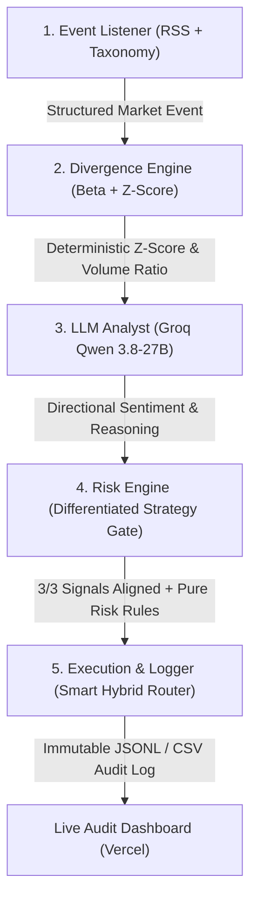

# AfterHours Sentinel

> **Autonomous Event-Driven Trading Agent for Tokenized U.S. Equities (rTokens) on Bitget**  
> *Bitget AI Base Camp Hackathon S2 — Agentic Trading Track (Event-Driven Agent Sub-Theme)*  
> **Live Audit Dashboard:** [https://afterhours-sentinel.vercel.app/](https://afterhours-sentinel.vercel.app/)  
> **GitHub Repository:** [https://github.com/0xSheriff/afterhours-sentinel](https://github.com/0xSheriff/afterhours-sentinel)

---

## 1. Overview & Core Thesis

**AfterHours Sentinel** is an autonomous, event-driven trading agent engineered to exploit price dislocations in tokenized U.S. equities (rTokens) on Bitget during after-hours sessions (post-market 16:00–09:30 ET and 24/7 weekends).

After-hours equity markets exhibit structural liquidity thinning. When breaking macroeconomic news, tariff announcements, or earnings releases occur, orderbooks experience extreme asymmetry:
1. **Thin-Liquidity Knee-Jerk Overreactions (Mean Reversion):** Algorithmic stop-runs and retail panic cause prices to dislocate far beyond benchmark-implied moves on weak volume. Sentinel detects these statistical anomalies ($|z| \ge 2.0\sigma$) and executes disciplined mean-reverting fade trades with strict risk controls.
2. **Persistent Fundamental Catalysts (Momentum / PEAD):** In genuine earnings surprises and major product releases, price dislocations backed by heavy, confirming volume continue drifting in the catalyst direction (Post-Earnings Announcement Drift). Sentinel routes these to a momentum qualification engine.

---

## 2. Non-Negotiable Safety Constraints

To guarantee strict capital protection and zero unintended exposure:
1. **Paper-Trading Isolation**: All execution targets Bitget Agent Hub in `--paper-trading` mode against Bitget's Demo environment (`DEMO_MODE=True`). Mainnet live accounts are strictly isolated.
2. **Smart Hybrid Execution Router**: Operates with `DEFAULT_DRY_RUN = False` in [`config.py`](file:///Users/mac/AH-Sentinel/config.py) and [`execution.py`](file:///Users/mac/AH-Sentinel/execution.py). Contracts verified via `get_supported_contracts()` (`GET /api/v2/mix/market/contracts?productType=usdt-futures`) as listed on Bitget Demo (`NVDAUSDT`, `TSLAUSDT`, `AAPLUSDT`, `AMZNUSDT`, `GOOGLUSDT`, `METAUSDT`, `COINUSDT`, `MSTRUSDT`, plus `BTCUSDT` and `ETHUSDT`) route orders to the Bitget Demo exchange (`status: "FILLED"`). The remaining 7 tracked equities that are not listed on Bitget Demo (`MSFT`, `AMD`, `INTC`, `ARM`, `PLTR`, `BABA`, `NFLX`) fall back to local client-side simulation (`status: "DRY_RUN_SIMULATED"`, tagged `[Smart Hybrid: Paper Fallback]`).
3. **Zero Dangerous Endpoints**: Zero withdrawal, transfer, or mass-cancellation endpoints exist in the codebase.
4. **Transparent Client Logging**: Tracks routing via `BitgetAgentHubClient` against official `api.bitget.com` demo endpoints with fallback to local `MockExecutionClient`.

---

## 3. Architecture (Strict 5-Stage Pipeline)


```mermaid
graph TD
    A["1. Event Listener (RSS + Taxonomy)"] -->|Structured Market Event| B["2. Divergence Engine (Beta + Z-Score)"]
    B -->|Deterministic Z-Score & Volume Ratio| C["3. LLM Analyst (Groq Qwen 3.8-27B)"]
    C -->|Directional Sentiment & Reasoning| D["4. Risk Engine (Differentiated Strategy Gate)"]
    D -->|3/3 Signals Aligned + Pure Risk Rules| E["5. Execution & Logger (Smart Hybrid Router)"]
    E -->|Immutable JSONL / CSV Audit Log| F["Live Audit Dashboard (Vercel)"]
```

### Component Breakdown & Mathematical Rigor

#### 1. Event Listener (`event_listener.py`)
- Polls 7 financial, macroeconomic, and equity-specific RSS feeds (Yahoo Finance Top Stories, Yahoo Finance Equities, Seeking Alpha Market Currents, Investing.com News & Stock Market, MarketWatch Top Stories & Real-Time Headlines) with automated deduplication and a **4-hour freshness filter**.
- **Zero-Cost Entity Resolver**: Extracts company names, tickers, products, and executive leadership (e.g. Musk, Nadella, Saylor, Karp) across the **15 tracked single-stock equities**. Events without equity mentions are classified as `SKIPPED_NO_ASSET_MATCH` with **zero LLM tokens spent**.
- **Standardized 9-Category Taxonomy**: Categorizes news into `earnings`, `macro`, `regulatory`, `tariff`, `geopolitical`, `product`, `corporate`, `analyst`, and `other`.

#### 2. Deterministic Divergence Engine (`divergence_engine.py`)
- Pure, deterministic mathematics with **zero LLM dependencies**:
  $$\beta = \frac{\text{Cov}(R_{\text{asset}}, R_{\text{bench}})}{\text{Var}(R_{\text{bench}})} \quad (\text{30-day rolling baseline})$$
  $$\text{expected\_move} = \beta \times \Delta_{\text{bench}}$$
  $$\text{residual} = \Delta_{\text{actual}} - \text{expected\_move}$$
  $$z = \frac{\text{residual}}{\sigma_{\text{residual}}} \quad (\text{defensive volatility floor } \sigma_{\min} = 80\text{ bps})$$
  $$\text{volume\_ratio} = \frac{\text{Volume}_{\text{after\_hours}}}{\overline{\text{Volume}}_{\text{trailing}}}$$
- **Empirical Volume Fallback**: When Bitget Demo 1H candle history is sparse ($<3$ candles), Sentinel dynamically falls back to the rolling 24H ticker volume normalized to hourly ($\text{Vol}_{24\text{h}} / 24$). Tagged `volume_basis: "FALLBACK_ESTIMATE"` for complete data-provenance transparency.
- **Extended-Hours Feed for Unlisted Equities**: For the 7 tracked equities not listed on Bitget Demo (`MSFT`, `AMD`, `INTC`, `ARM`, `PLTR`, `BABA`, `NFLX`), `live.py` queries Yahoo Finance 5-minute extended-hours bars (`includePrePost=true`) to compute live post-market price moves and volume ratios.

#### 3. LLM Analyst (`llm_analyst.py`)
- Executes OpenAI-compatible inference against Groq using model `"qwen/qwen3.8-27b"` (`config.GROQ_MODEL`).
- **Explainability & Isolation**: The LLM **never** sees the z-score or makes trade decisions; it strictly performs directional classification (`BULLISH`, `BEARISH`, `NEUTRAL`) and provides one sentence of qualitative rationale.
- **Three-Way Provenance Tagging**:
  - `LIVE`: Verified real-time Groq API calls (`llm_source: "groq_qwen3.8-27b [live_api]"`).
  - `FALLBACK`: Deterministic keyword rules activated when API limits are reached (`llm_source: "fallback_rules [...]"`).
  - `SKIPPED`: Zero-token pre-filtered macro noise (`llm_source: "skipped"`).

#### 4. Dual-Strategy Risk Engine (`risk_engine.py`)
Pure rule-based gatekeeper evaluating dynamic strategy modes:
- **`MEAN_REVERSION` Mode** (`macro`, `tariff`, `geopolitical`, `regulatory`, `corporate`, `other`):
  - Requires: Direction Contradiction (price moved opposite to fundamental news) + Weak Liquidity (`volume_ratio < 0.50`) + Statistical Outlier ($|z| \ge 2.0\sigma$).
- **`MOMENTUM` Mode** (`earnings`, `product`, `analyst`):
  - Requires: Direction Alignment (price confirmed by fundamental upside/downside) + Confirming Volume (`volume_ratio \ge 0.80`) + Statistical Breakout ($|z| \ge 2.0\sigma$).
  - *Analyst Routing Note*: `analyst` events currently route to `MOMENTUM` in `risk_engine.py`. An earlier commit note (`2d3208b`) stated that all 35 historical analyst events showed `ALIGNMENT`, but ground-truth inspection of `logs/sentinel_trades.jsonl` shows that 33 of those 36 early records were `SKIPPED_NO_ASSET_MATCH` (which default `direction_alignment` to `"ALIGNMENT"` without price/LLM evaluation). Across the 60 matched-asset `analyst` events in the full live log, the empirical distribution is 28 `ALIGNMENT` (46.7%), 19 `CONTRADICTION` (31.7%), and 13 `NEUTRAL` (21.7%); full base-rate validation remains mixed.
- **Portfolio Defense Rules**:
  - Fixed **5% portfolio sizing** per trade (`POSITION_SIZE_PCT = 0.05` against Bitget Demo Multi-Asset Union Margin `unionTotalMargin` $\approx \$62,858.40$).
  - Hard stop loss at **1.5% from entry** (`STOP_LOSS_PCT = 0.015`).
  - Take-profit target at **3.0%** (`TAKE_PROFIT_PCT = 0.03`).
  - Maximum **3 concurrent open positions** (`MAX_OPEN_POSITIONS = 3`).
  - Daily loss limit of **3% of portfolio** (`DAILY_LOSS_LIMIT_PCT = 0.03`, automatic circuit-breaker trading halt).

#### 5. Smart Hybrid Execution Router & Logger (`execution.py`)
- **Dynamic Contract Discovery**: Queries Bitget Demo's live contract specifications (`/api/v2/mix/market/contracts?productType=usdt-futures`) to route the 8 exchange-listed equity contracts (`NVDAUSDT`, `TSLAUSDT`, `AAPLUSDT`, `GOOGLUSDT`, `AMZNUSDT`, `METAUSDT`, `COINUSDT`, `MSTRUSDT`) directly to Bitget's Demo matching engine via authenticated HMAC-SHA256 REST orders.
- **Client-Side Simulation Fallback**: The 7 tracked equities not listed on Bitget Demo (`MSFT`, `AMD`, `INTC`, `ARM`, `PLTR`, `BABA`, `NFLX`) are routed to local client-side simulation and explicitly tagged `[Smart Hybrid: Paper Fallback]` (`status: "DRY_RUN_SIMULATED"`).
- Appends immutable audit records to `logs/sentinel_trades.jsonl` and `logs/sentinel_trades.csv`.

---

## 4. Tracked Asset Universe (15 Equities + 2 Reference Benchmarks)

Sentinel tracks 15 single-stock equities (8 listed on Bitget Demo USDT-Futures and 7 evaluated via Yahoo Finance extended-hours data with client-side paper simulation) against 2 reference benchmarks:

| Category | Count | Bitget Demo Listed (`FILLED`) | Unlisted / Client-Side Simulated (`DRY_RUN_SIMULATED`) | Benchmark Routing |
|---|:---:|---|---|:---:|
| **Semiconductor & Hardware** | 5 | `NVDA` ($\beta=1.35$), `AAPL` ($\beta=1.05$) | `AMD` ($\beta=1.40$), `INTC` ($\beta=1.10$), `ARM` ($\beta=1.55$) | `QQQ` (6-Peer Composite) |
| **Enterprise Cloud & AI** | 4 | `GOOGL` ($\beta=1.10$), `AMZN` ($\beta=1.20$) | `MSFT` ($\beta=1.15$), `PLTR` ($\beta=1.65$) | `QQQ` (6-Peer Composite) |
| **Consumer Tech & Media** | 3 | `TSLA` ($\beta=1.45$), `META` ($\beta=1.25$) | `NFLX` ($\beta=1.20$) | `QQQ` (6-Peer Composite) |
| **Crypto-Correlated Equities** | 2 | `COIN` ($\beta=2.20$), `MSTR` ($\beta=2.50$) | — | Primary: `QQQ` · Secondary: `BTC` (`BTCUSDT`) |
| **China Tech ADR** | 1 | — | `BABA` ($\beta=0.95$) | `QQQ` (6-Peer Composite) |
| **Reference Benchmarks** | 2 | `BTCUSDT` (Exchange Contract) | `QQQ` (Equal-Weighted Composite of `NVDA`, `AAPL`, `GOOGL`, `AMZN`, `META`, `TSLA`) | Reference Baselines |

> **Crypto-Correlated Equities Architecture Note:** `COIN` and `MSTR` are assigned `QQQ` as their primary equity benchmark to maintain mathematical parity across the 15-stock pipeline, while documenting that their primary fundamental risk driver is spot Bitcoin volatility. Their higher initial betas ($\beta = 2.20$ and $2.50$) absorb this crypto-driven variance.

---

## 5. Dual-Scenario Verification Proof

| Scenario | Mode | Trigger Event | Mathematical Verification | Outcome |
|---|:---:|---|---|:---:|
| **Scenario 1: Live Competition Near-Miss** | **Live** | U.S. Imposes Strict New Tariffs on Semiconductor Packaging Equipment | Expected: $+2.68\%$<br>Actual: $+1.33\%$<br>Residual: $-1.35\%$<br>**Z-Score: $-1.69\sigma$ ($< 2.0\sigma$ threshold)** | **`NO_TRADE` (Capital Protected)**<br>*Risk gate blocked execution: only 2/3 signals aligned.* |
| **Scenario 2: Pre-Competition Calibration** | **Backtest** | Semiconductor Tariff Overreaction (NVDA) | Dislocation: **$+3.62\sigma \ge 2.0\sigma$**<br>Weak Volume: $0.21\text{x}$<br>Signals Aligned: $3/3$ | **`SHORT` Executed & Closed**<br>Entry: $\$128.50$ · Exit: $\$124.00$<br>**P&L: $+\$105.06$ (Take-Profit Hit)** |

---

## 6. Quick Start & CLI Usage

### 1. Run Complete Test Suite (Zero External Dependencies)
```bash
python3 -m unittest discover -s tests -v
# Output: Ran 66 tests in ~3.3s — OK (100% pass rate)
```

### 2. Historical Replay (Backtest Validation)
```bash
python3 historical_replay.py
```

### 3. Verify Bitget Demo Connection & Clock Sync
```bash
python3 verify_bitget_connection.py
```

### 4. Inspect Live Bitget Demo Positions & Balance
```bash
python3 scripts/check_positions.py
```

### 5. Continuous Background Supervisor
```bash
# Launch unattended supervisor with auto-restart backoff and hourly heartbeats
./scripts/start_sentinel.sh

# Check live process uptime, worker PID, and continuous monitoring span
./scripts/status_sentinel.sh

# Stop supervisor and worker cleanly
./scripts/stop_sentinel.sh
```

### 6. Interactive Audit Dashboard
```bash
cd dashboard
npm install
npm run build   # Production bundle to dist/
npm run preview # Preview production build locally
```
*Live cloud deployment:* **[https://afterhours-sentinel.vercel.app/](https://afterhours-sentinel.vercel.app/)**

---

## 7. Audit Trail & Verification Telemetry

The canonical record of all autonomous decisions is maintained in `logs/`:
* **`logs/sentinel_trades.jsonl`**: Complete JSON Lines log spanning **485.9 hours** of `mode="live"` monitoring (`2026-09-17 18:53 UTC` to `2026-10-08 00:45 UTC`) across **3,175 live event evaluations** (`3,217` total records including `8` `backtest`, `26` `live_dryrun_mock`, and `8` test records).
  * **Live LLM vs. Deterministic Fallback Provenance (`3,175` live records)**: `142` real-time Groq `qwen/qwen3.8-27b [live_api]` classifications, `343` deterministic keyword fallback classifications (`fallback_rules [...]`), and `2,690` pre-filtered `SKIPPED_NO_ASSET_MATCH` events (`llm_source: "skipped"`).
  * **Live Execution Breakdown (Strictly Separated by Route)**:
    * **Bitget Demo Exchange-Executed Trades (`BitgetAgentHubClient [Demo Environment: api.bitget.com]`)**: **16 closed trades** across exchange-listed contracts (`NVDA`: 5, `TSLA`: 3, `AAPL`: 3, `AMZN`: 2, `META`: 1, `MSTR`: 1, `COIN`: 1) — **11 wins / 5 losses (68.8% win rate), `+$338.49` realized P&L** (0 positions currently open).
    * **Client-Side Simulated Fallback Trades (`[Smart Hybrid: Paper Fallback]`)**: **12 closed simulated trades** on unlisted tickers (`AMD`: 4, `MSFT`: 3, `PLTR`: 2, `NFLX`: 2, `INTC`: 1) — **12 wins / 0 losses (100.0% win rate), `+$418.61` client-side simulated P&L**.
    * **Rejected / Skipped**: **457 `NO_TRADE`** risk-gate rejections and **2,690 `SKIPPED_NO_ASSET_MATCH`** events.
* **`logs/sentinel_trades.csv`**: Tabular export of all logged decisions.
* **`logs/submission_audit_trail.csv`**: Verified competition dataset (distinguishing live vs calibration backtest data).
* **`logs/heartbeat.log`**: Hourly supervisor heartbeats recording process health.
* **Pre-Competition Manual Connectivity Test Disclosure (Sept 16, 2026)**: Prior to starting the autonomous live log on `2026-09-17 18:53 UTC`, manual API connectivity test fills on `NVDAUSDT` and `TSLAUSDT` on Sept 16 incurred an initial `~$0.0515` balance adjustment (and `~$1.34` cumulative fee/test delta against the initial `5,000.00 USDT` allocation, leaving `4,998.66 USDT` cash alongside `0.4 BTC` and `9.0 ETH` in Bitget Demo Multi-Asset Union Margin). These manual connectivity tests are excluded from autonomous agent trade metrics.

---

## 8. Open Source License

MIT License. Built for the **Bitget AI Base Camp Hackathon S2 (Agentic Trading Track)**. All models, mathematical proofs, and logs are authentic and reproducible.
